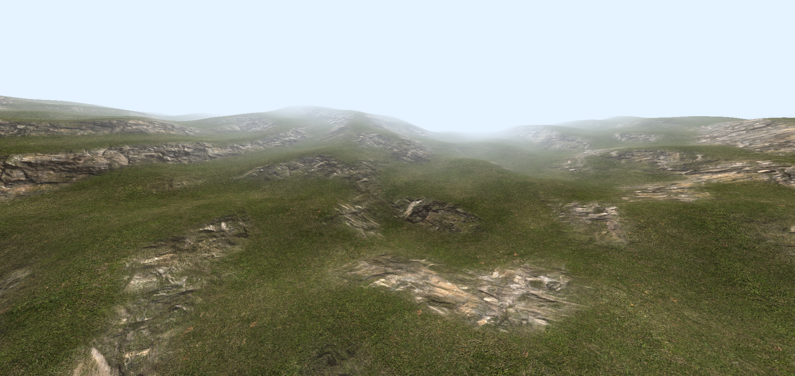
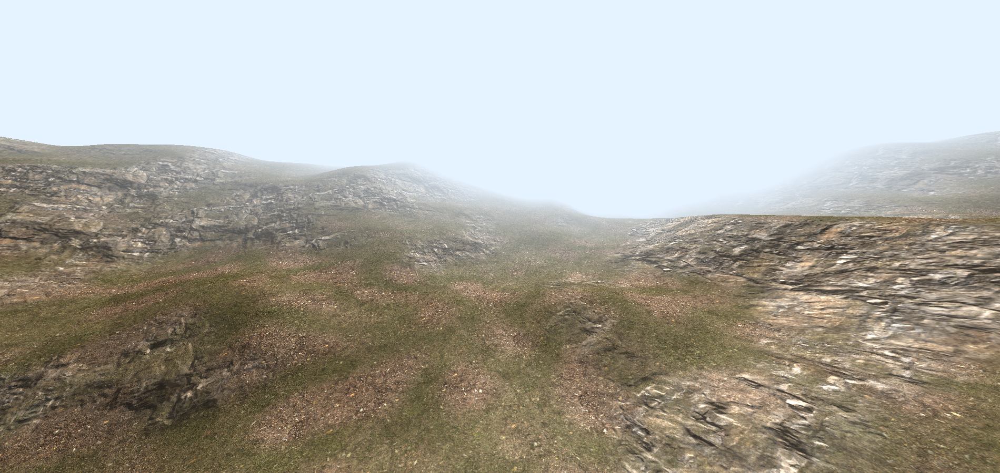
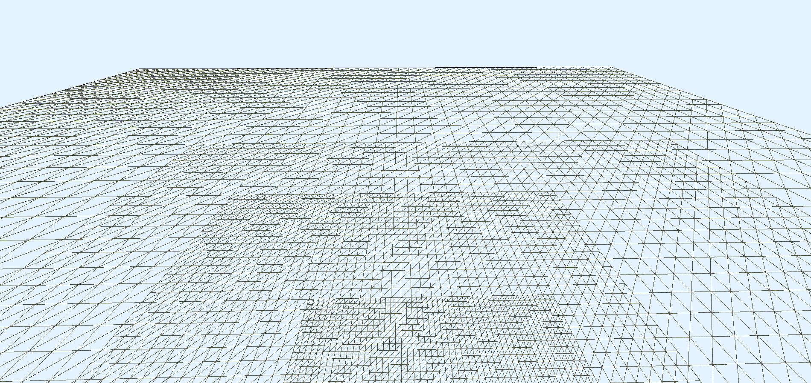
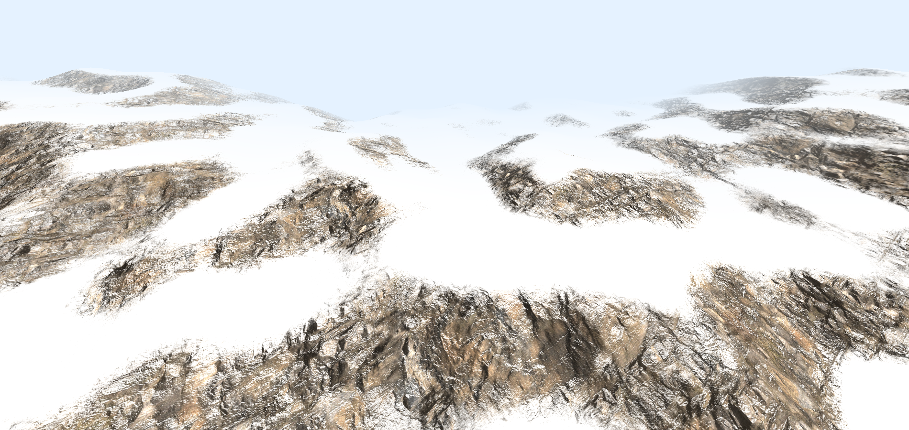

# Procedural Terrain Engine
This is an OpenGL terrain engine designed for the specialized implementation of runtime virtual texturing for terrain. It is inspired by the Frostbite Engine's terrain system and John Carmack's Id Tech Engine for virtual textures. For geometry rendering, I have made some adjustments to Hugues Hoppe’s clipmap rendering technique. Streaming virtual textures are also employed for the heightmap. These techniques enable the rendering of vast terrain areas spanning several square kilometers with high visual quality.

### ScreenShots

### Clipmap Rendering

## Runtime Virtual Textures
  |

## Slope Based Dampening

## How To Build
This is a CMake project with no external dependencies. It has been tested on Windows.

## How To Use
* Right Mouse Click: Enables free-flight mode over the terrain.
* W: Move forward.
* S: Move backward.
* A: Move left.
* D: Move right.
* E: Ascend.
* Q: Descend.

## Future Plans
* Adding terrain-blended objects such as rocks.
* Implementing vegetation, including trees, bushes, and grass.
* Introducing lakes and seas.
* Adding volumetric clouds.
* Supporting decals.

## References
- **Clipmap Rendering**  
  - [Clipmap Rendering Using Nested Grids](https://developer.nvidia.com/gpugems/gpugems2/part-i-geometric-complexity/chapter-2-terrain-rendering-using-gpu-based-geometry): NVIDIA's guide on GPU-based geometry for terrain rendering.
  - [Virtual Texturing for Heightmaps](https://notkyon.moe/vt/Clipmap.pdf): Detailed documentation on implementing virtual texturing for heightmaps.

- **Frostbite Engine**  
  - [Terrain in Battlefield 3: A Modern, Scalable System](https://media.contentapi.ea.com/content/dam/eacom/frostbite/files/gdc12-terrain-in-battlefield3.pdf): Insights into Frostbite's terrain rendering system.  
  - [Procedural Shader Splatting](https://media.contentapi.ea.com/content/dam/eacom/frostbite/files/chapter5-andersson-terrain-rendering-in-frostbite.pdf): Explanation of shader-based terrain texturing in Frostbite.

- **Tutorials**  
  - [Learn OpenGL](https://learnopengl.com): Comprehensive tutorials for mastering OpenGL.  
  - [Terrain Material Tutorial Series](https://www.youtube.com/watch?v=yCRzOdo4b68&t=8s&ab_channel=UnrealSensei): Step-by-step guide for creating realistic terrain materials in Unreal Engine.  